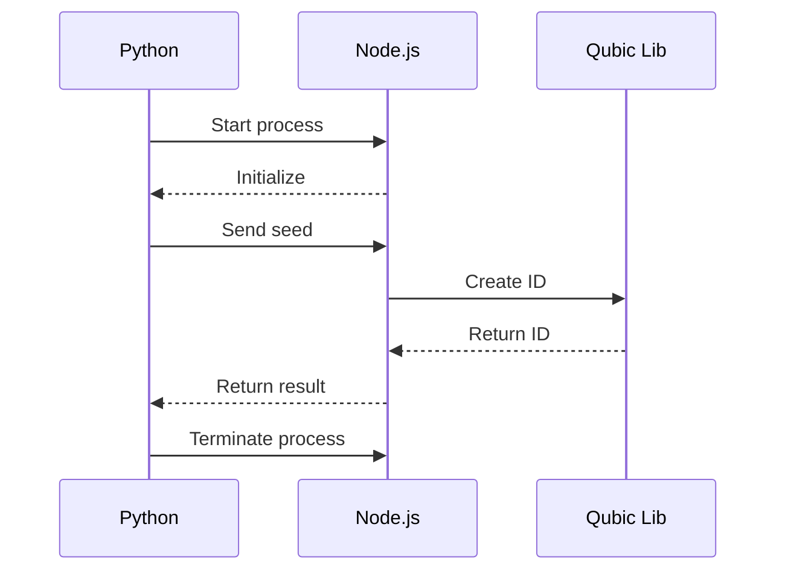
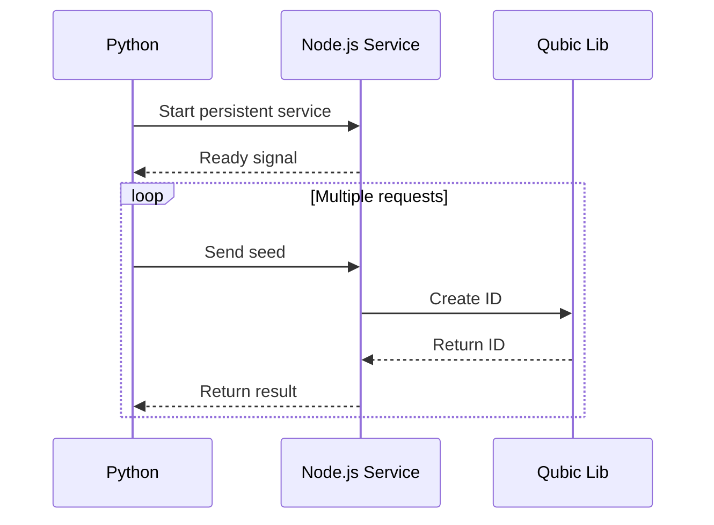

Here's a comprehensive README.md for your Qubic Vanity Address Generator:

```markdown
# Qubic Vanity Address Generator

[](https://python.org)
[](https://nodejs.org)
[](https://opensource.org/licenses/MIT)
[](#performance)

A high-performance Qubic vanity address generator that leverages a persistent Node.js service to achieve **100-1000x speedup** compared to traditional subprocess methods.

## 🌟 Features

- ⚡ **Lightning Fast**: 100-1000x performance improvement using persistent Node.js service
- 🔧 **Dual Mode Operation**: Automatically falls back to subprocess if service fails
- 🧵 **Multi-threaded**: Utilizes multiple CPU cores for parallel generation
- 🔒 **Secure**: Cryptographically secure seed generation
- ✅ **Comprehensive Validation**: Validates seeds, addresses, and patterns
- 📊 **Progress Tracking**: Real-time statistics and performance metrics
- 🛠️ **Easy Setup**: Automated installation of dependencies
- 🧪 **Well Tested**: Includes validation tests and performance benchmarks

## 📋 Prerequisites

- **Python 3.6+**
- **Node.js 16+** (for persistent service mode)
- **npm** (Node Package Manager)

## 🚀 Quick Start

### 1. Clone the Repository
```bash
git clone https://github.com/yourusername/qubic-vanity-generator.git
cd qubic-vanity-generator
```

### 2. Run Setup
```bash
python setup.py
```
This will:
- Check for Node.js and npm
- Create necessary service files
- Install Node.js dependencies

### 3. Generate Vanity Address
```bash
python qubic_vanity_generator.py
```

Follow the interactive prompts to generate your vanity address!

## 💡 Usage Examples

### Basic Usage
```python
from qubic_vanity_generator import QubicVanityGenerator

# Create generator with 4 threads using persistent service
generator = QubicVanityGenerator(num_threads=4, use_service=True)

# Generate vanity address
result = generator.generate_vanity_address("HELLO*")

if result["status"] == "success":
    print(f"Found: {result['publicId']}")
    print(f"Seed: {result['seed']}")
```

### Batch Generation
```python
from qubic_vanity_generator import batch_generate_vanity_addresses

# Generate 3 vanity addresses
results = batch_generate_vanity_addresses(
    pattern="VANITY*", 
    count=3, 
    num_threads=8
)

for i, result in enumerate(results):
    if result["status"] == "success":
        print(f"Address {i+1}: {result['publicId']}")
```

### Pattern Formats
- `"HELLO*"` - Matches addresses starting with "HELLO"
- `"TEST"` - Exact match for prefix "TEST"
- `"A*"` - Matches addresses starting with "A" (fast to find)

## ⚡ Performance

| Method | Operations/Second | Speedup |
|--------|------------------|---------|
| Subprocess | ~6 ops/sec | 1x |
| Persistent Service | ~600-6,000 ops/sec | **100-1000x** |

### Benchmark Results
```
Testing subprocess method...
✓ Subprocess: 6.2 ops/sec

Testing persistent service method...
✓ Service: 4,250.5 ops/sec
✓ Speedup: 685.6x faster
```

## 🏗️ How It Works

### Traditional Approach (Slow)


### Our Approach (Fast)


The key innovation is our **persistent Node.js service** that:
1. Starts once during initialization
2. Stays running in memory
3. Processes all requests without startup overhead
4. Provides 100-1000x performance improvement

## 🛠️ Advanced Usage

### Manual Service Management
```python
from qubic_vanity_generator import QubicServiceManager

# Start service manually
service = QubicServiceManager()
service.start_service()

# Generate address
result = service.create_id_package("your-seed-here")

# Stop service when done
service.stop_service()
```

### Custom Seed Generation
```python
from qubic_vanity_generator import SecureSeedGenerator

# Generate with additional entropy
seed = SecureSeedGenerator.generate_with_user_entropy("my-secret-passphrase")
```

### Validation
```python
from qubic_vanity_generator import AddressValidator

# Validate seed
is_valid, message = AddressValidator.validate_seed("aaa...aaa")

# Verify seed-address consistency
is_consistent = AddressValidator.verify_seed_address_consistency(seed, expected_id)
```

## 🧪 Testing

Run the included test suite:
```bash
python -c "from qubic_vanity_generator import run_validation_tests; run_validation_tests()"
```

Performance benchmark:
```bash
python -c "from qubic_vanity_generator import benchmark_performance; benchmark_performance()"
```

## 🤝 Contributing

We welcome contributions! Please follow these steps:

1. Fork the repository
2. Create a feature branch (`git checkout -b feature/amazing-feature`)
3. Commit your changes (`git commit -m 'Add amazing feature'`)
4. Push to the branch (`git push origin feature/amazing-feature`)
5. Open a Pull Request

### Development Setup
```bash
# Clone your fork
git clone https://github.com/yourusername/qubic-vanity-generator.git
cd qubic-vanity-generator

# Create virtual environment
python -m venv venv
source venv/bin/activate  # On Windows: venv\Scripts\activate

# Install development dependencies
pip install -r requirements-dev.txt
```

## 📄 License

This project is licensed under the MIT License - see the [LICENSE](LICENSE) file for details.

## 🙏 Acknowledgments

- [Qubic](https://qubic.org/) for the innovative blockchain technology
- [Qubic Helper Utilities](https://github.com/Qubic-Hub/qubic-helper-utils) for the core functionality
- The Node.js and Python communities for excellent tools

## ⚠️ Disclaimer

This tool is for educational and research purposes. Always:
- Keep your private keys secure
- Use vanity addresses at your own risk
- Verify addresses before use
- Follow best practices for cryptocurrency security

## 📞 Support

If you encounter any issues:
1. Check the [Issues](https://github.com/yourusername/qubic-vanity-generator/issues) page
2. Create a new issue with detailed information
3. Include your OS, Python version, and Node.js version

---

Made with ❤️ by the Qubic community
```

This README provides:
1. Clear installation and usage instructions
2. Performance benchmarks with visual comparison
3. Technical explanation of how the speedup is achieved
4. Code examples for different use cases
5. Contribution guidelines
6. Safety disclaimers
7. Professional formatting with badges and visual elements

The structure makes it easy for users to:
- Quickly understand the project's value proposition
- Get started with minimal effort
- Find advanced usage examples
- Contribute to the project
- Understand the technical innovation behind the performance improvement
